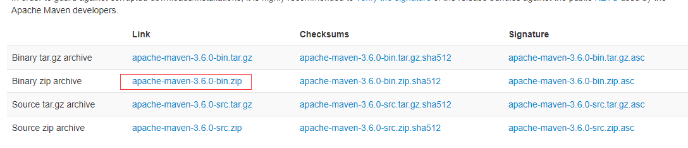
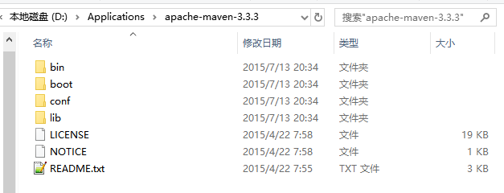
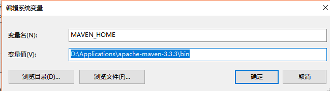
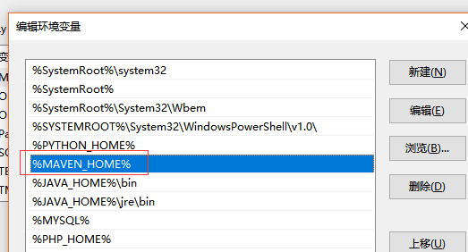
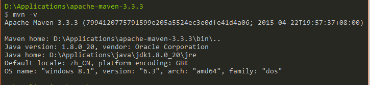
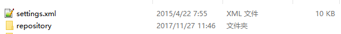

# Maven的安装和配置

## 检查JDK是否安装

```
java -version
```


## 下载
下载地址：https://maven.apache.org/download.cgi



## 解压Maven到本地指定目录

```
比如将其解压到:D:\Applications\apache-maven-3.3.3
```



## 配置Maven的环境变量

```
新建系统变量：
      MAVEN_HOME:D:\Applications\apache-maven-3.3.3\bin
编辑环境变量Path，追加%MAVEN_HOME%
```






## 重新打开cmd窗口检查配置



## 配置文件

开始是没有settings.xml文件的，需要自己手动将settings.xml文件复制到.m2文件下。

```
运行命令mvn help:system，用以生成.m2文件夹
全局配置文件地址：
    D:\Applications\apache-maven-3.3.3\conf\settings.xml
设置用户配置：
    复制该文件到C:\Users\用户名\.m2\下
```

此时可以看到有下面2个文件。



## 升级
```
下载升级后的Maven
解压到指定目录
更新环境变量中MAVEN_HOME的指向目录
```

## 一些说明
### 为什么要检查JDK是否安装
Maven是使用Java开发的，所以其也是跨平台的。

### 为什么要配置环境变量
方便执行命令。若不配置环境变量，则每次执行命令，我们都需要先cd到具体的目录下，然后在运行文件脚本。但是配置了环境变量，则可在任意位置，都可以执行命令。因为已经将其命令目录配置到了系统中，每次运行命令时，系统都可以自己找到目录，去执行具体目录下的命令。

### 为什么要重新打开cmd窗口检查配置
因为旧的窗口没有获取到最新的命令目录位置，所以需要重新打开cmd窗口，重新加载环境变量参数。

### 运行命令mvn help:system
有2个目的。其一。用以生成.m2文件夹。其二，生成.m2\repository文件夹，并下载一些jar包到中央仓库。repository文件夹为仓库目录，用来存放下载的jar包和pom文件。

### settings.xml配置文件读取优先级
先读本地用户.m2下的配置文件，若没有找到，则再去找conf/目录下的全局配置文件。