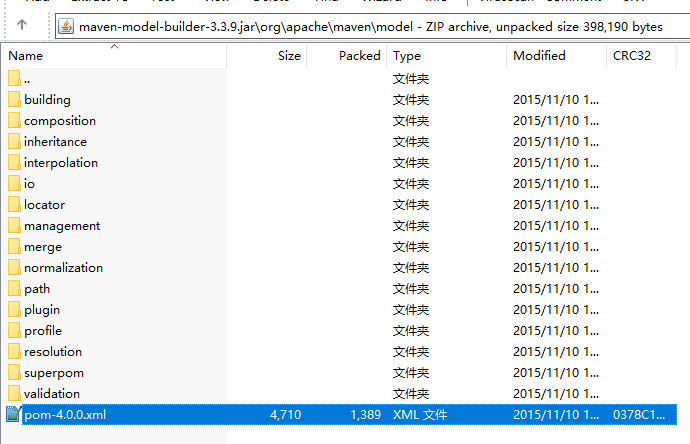

# Maven的目录结构

## Maven的目录结构示意图
下面是Maven的目录结构

```
Maven
│  LICENSE
│  NOTICE
│  README.txt
│  
├─bin
│      m2.conf
│      mvn
│      mvn.cmd
│      mvnDebug
│      mvnDebug.cmd
│      mvnyjp
│      
├─boot
│      plexus-classworlds-2.5.2.jar
│      
├─conf
│  │  settings.xml
│  │  toolchains.xml
│  │  
│  └─logging
│          simplelogger.properties
│          
└─lib（依赖包，未展示）
```

## 目录结构说明

### bin
命令mvn运行的脚本及一些配置，其中可以看到，设置.m2地址。这里是缺少了一个“.”，不是/.m2，而是m2。
```
set maven.home default ${user.home}/m2
```

### boot
类加载器框架文件plexus-classworlds-2.5.2.jar。Maven用该框架加载自己的类库。

### conf（相关链接：1、Maven的安装和配置）
该目录为全局配置目录。需要将其配置到.m2文件下，使其为用户配置。复制该目录下的settings.xml文件到C:\Users\用户名\.m2\下，也就是 ${user.home}/m2下。

### lib
Maven运行时所需要的依赖包。可以看到都是一些jar包，说明Maven是使用Java开发的。
同时需要特别注意maven-model-builder-x.x.x.jar这个文件，x.x.x为版本号，不同版本，其版本号不同。打开该文件，能找到超级POM：\org\apache\maven\model\pom-4.0.0.xml。它是所有Maven POM的父POM，所有的Maven项目继承该配置。


## 超级POM
主要定义了项目的结构。比如，编译好的文件放在target目录下，源码放在src/main/java目录下，测试放在/src/test/java目录下，资源放在src/main/resources目录下等。
这里主要体现了Maven的核心思想，约定优于配置(Convention Over Configuration)。即，Maven有其自己默认的一套约定，需要大家都遵守，除非必要，就不要去修改那些约定内容，也就是不随意修改配置的内容。比如刚刚说的定义了项目的结构，大家都按照这个目录结构来，构建项目的时候，Maven就可以统一处理，大家也可以不用再去配置目录结构，只用直接运行命令就可以了构建项目了，十分省时省事。



### 超级POM定义了项目的目录结构
在超级POM中，定义了下面的目录结构：
```
<build>
    <directory>${project.basedir}/target</directory>         
    <outputDirectory>${project.build.directory}/classes</outputDirectory>
    <finalName>${project.artifactId}-${project.version}</finalName>
    <testOutputDirectory>${project.build.directory}/test-classes</testOutputDirectory>
    <sourceDirectory>${project.basedir}/src/main/java</sourceDirectory>
    <scriptSourceDirectory>${project.basedir}/src/main/scripts</scriptSourceDirectory>
    <testSourceDirectory>${project.basedir}/src/test/java</testSourceDirectory>
    <resources>
      <resource>
        <directory>${project.basedir}/src/main/resources</directory>
      </resource>
    </resources>
    <testResources>
      <testResource>
        <directory>${project.basedir}/src/test/resources</directory>
      </testResource>
    </testResources>
</build>
```

### 实际项目的目录结构
实际在项目中，下面则是对应的实际目录结构：
```
/项目目录
├─pom.xml 用于maven的配置文件
├─/src 源代码目录
│	├─/main 工程源代码目录
│	│	└─/java 工程java源代码目录
│	│	└─/resource 工程的资源目录
│	└─/test 单元测试目录
│		└─/java
│		└─/resource 工程的资源目录
└─/target 输出目录，所有的输出物都存放在这个目录下
	└─/classes 编译之后的class文件
```


